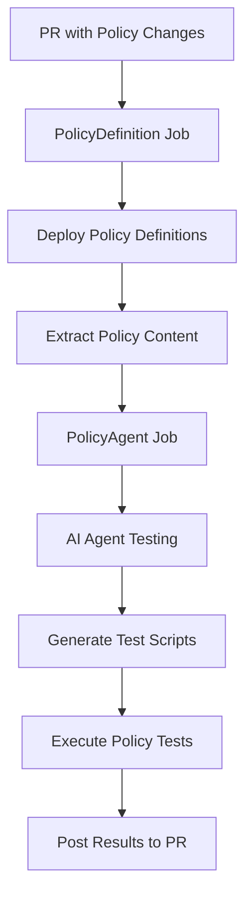

# Azure Policy Agent - GitHub Action Setup Guide

## Overview

The Azure Policy Agent is an intelligent GitHub Action workflow that automates the deployment and testing of Azure Policy definitions using AI-powered validation. This workflow combines Infrastructure as Code (IaC) practices with AI-driven policy testing to ensure your Azure policies are both syntactically correct and functionally effective.

## What It Does

The PolicyAgent workflow provides an end-to-end solution for Azure Policy management:

### 🔄 **Automated Policy Deployment**
- Automatically detects changes to policy definition files in pull requests
- Deploys Azure Policy definitions to your Azure subscription
- Creates policy assignments for testing purposes
- Validates policy syntax and structure

### 🤖 **AI-Powered Policy Testing**
- Uses Azure AI Foundry Agent Service to intelligently test policies
- Generates realistic test scenarios for policy validation
- Creates PowerShell scripts to simulate policy enforcement
- Provides detailed feedback on policy effectiveness

### 📊 **Comprehensive Reporting**
- Posts detailed test results as pull request comments
- Includes success/failure status for each policy
- Provides actionable insights and recommendations
- Tracks policy enforcement behavior

## Workflow Architecture

The workflow consists of two main jobs:

1. **PolicyDefinition Job**: Deploys policy definitions and prepares content for testing
2. **PolicyAgent Job**: Executes AI-powered testing and reports results



## Prerequisites

Before setting up the PolicyAgent workflow, ensure you have:

- An Azure subscription with appropriate permissions
- An Azure AI Foundry project with a configured agent
- A GitHub repository with the workflow files
- An Azure service principal configured for federated authentication

## Required Permissions

### Azure Permissions
Your service principal needs the following Azure RBAC roles:

- **User Access Administrator**: To create and manage policy definitions and assignments
- **Azure AI User**: To interact with Azure AI services
- **Contributor**: For all other resources

### GitHub Permissions
The workflow requires these GitHub permissions:

```yaml
permissions:
  id-token: write      # For federated authentication
  contents: write      # To read repository contents
  pull-requests: write # To post comments on PRs
```

## Setup Instructions

### 1. Configure Azure Service Principal with Federated Credentials

#### Create Service Principal
```bash
# Create the service principal
az ad sp create-for-rbac --name "PolicyAgent-SP" --role contributor --scopes /subscriptions/{subscription-id}

# Note the output values:
# - appId (Client ID)
# - tenant (Tenant ID)
```

#### Configure Federated Identity Credentials
```bash
# Add federated credential for the main branch
az ad app federated-credential create \
  --id {app-id} \
  --parameters '{
    "name": "PolicyAgent-Main",
    "issuer": "https://token.actions.githubusercontent.com",
    "subject": "repo:{owner}/{repo}:ref:refs/heads/main",
    "audiences": ["api://AzureADTokenExchange"]
  }'

# Add federated credential for pull requests
az ad app federated-credential create \
  --id {app-id} \
  --parameters '{
    "name": "PolicyAgent-PR",
    "issuer": "https://token.actions.githubusercontent.com",
    "subject": "repo:{owner}/{repo}:pull_request",
    "audiences": ["api://AzureADTokenExchange"]
  }'
```

### 2. Configure GitHub Repository

#### Required Secrets
Navigate to your GitHub repository → Settings → Secrets and variables → Actions

Add the following **Repository Secrets**:

| Secret Name | Description | Example Value |
|-------------|-------------|---------------|
| `AZURE_CLIENT_ID` | Service Principal Application (Client) ID | `12345678-1234-1234-1234-123456789012` |
| `AZURE_TENANT_ID` | Azure AD Tenant ID | `87654321-4321-4321-4321-210987654321` |
| `AZURE_SUBSCRIPTION_ID` | Target Azure Subscription ID | `abcdef12-3456-7890-abcd-ef1234567890` |

#### Required Variables
Add the following **Repository Variables**:

| Variable Name | Description | Example Value |
|---------------|-------------|---------------|
| `PROJECT_ENDPOINT` | Azure AI Foundry Project Endpoint | ` |
| `ASSISTANT_ID` | Azure AI Agent/Assistant ID | `asst_Yh8QGJKa0wAZA7DZQA7DZLTk` |

### 3. Set Up Azure AI Foundry Project

#### Create AI Foundry Project
1. Navigate to [Azure AI Foundry](https://ai.azure.com/)
2. Create a new project or use an existing one
3. Deploy a language model (e.g., GPT-4o)
4. Create an AI Agent with policy testing capabilities

#### Configure the AI Agent
Your AI agent should be configured with the system prompt here (agentInstructions)

#### Get Agent Details
```bash
# Get your project endpoint from AI Foundry portal
# Get your agent ID from the AI Foundry agent configuration
```

### 4. Repository Structure

Ensure your repository has the following structure:

```
your-repo/
├── .github/
│   ├── workflows/
│   │   └── PolicyAgent.yml
│   └── scripts/
│       ├── deploy-policies.ps1
│       ├── test-policies.ps1
│       └── get-changed-files.sh
├── policyDefinitions/
│   ├── your-policy-1.json
│   └── your-policy-2.json
└── utilities/
    └── policyAgent/
        ├── deployDef.ps1
        ├── policyDef.bicep
        └── policyDef.parameters.json
```

### 5. Policy Definition Format

Place your Azure Policy definitions in the `policyDefinitions/` folder as JSON files:

```json
{
  "properties": {
    "displayName": "Allowed locations for resources",
    "policyType": "Custom",
    "mode": "Indexed",
    "description": "This policy restricts locations for resource deployment",
    "metadata": {
      "category": "General"
    },
    "parameters": {
      "listOfAllowedLocations": {
        "type": "Array",
        "defaultValue": ["eastus", "westus2"],
        "metadata": {
          "displayName": "Allowed locations",
          "description": "List of allowed Azure regions"
        }
      }
    },
    "policyRule": {
      "if": {
        "not": {
          "field": "location",
          "in": "[parameters('listOfAllowedLocations')]"
        }
      },
      "then": {
        "effect": "deny"
      }
    }
  }
}
```

## Usage

### Triggering the Workflow

The workflow automatically triggers when:

1. **Pull Request Events**: When a PR is created or updated with changes to files in `policyDefinitions/*.json`
2. **Push to Main**: When changes are pushed directly to the main branch

### Workflow Execution

1. **File Detection**: The workflow identifies changed policy definition files
2. **Policy Deployment**: Deploys policies to Azure for testing
3. **AI Analysis**: The AI agent analyzes each policy and generates test scripts
4. **Test Execution**: Executes generated tests against Azure APIs
5. **Results Reporting**: Posts comprehensive results as PR comments

### Expected Output

The workflow will post a comment on your pull request with results like:

```markdown
## Azure Policy Test Results

### Summary: Processed 2 policy definition(s)

### ✅ Policy Test Completed Successfully for `policyDefinitions/allowed-locations.json`
The Policy '**Allowed locations for resources**' successfully validated the policy.

**Details:**
- **Status Code:** 403
- **Message:** Resource creation blocked by policy

---

### 🚫 Policy Test Failed for `policyDefinitions/weak-policy.json`
The request invalidated the policy rule.

**Details:**
- **Status Code:** 200
```

## Troubleshooting

### Common Issues

#### Authentication Failures
```
Error: AADSTS700016: Application with identifier 'xxx' was not found
```
**Solution**: Verify your service principal Client ID is correctly configured in GitHub secrets.

#### Permission Errors
```
Error: Insufficient privileges to complete the operation
```
**Solution**: Ensure your service principal has the required Azure RBAC roles.

#### AI Agent Not Found
```
Cannot find agent xxx. Please re-create it and retry
```
**Solution**: Verify your `ASSISTANT_ID` variable matches your AI Foundry agent ID.

#### Missing Files
```
No JSON files found in the 'policyDefinitions' directory
```
**Solution**: Ensure your policy files are in the correct directory and have `.json` extensions.

### Debug Steps

1. **Check GitHub Actions Logs**: Review the detailed logs in the Actions tab
2. **Verify Azure Permissions**: Test your service principal permissions manually
3. **Validate AI Configuration**: Test your AI agent independently
4. **Check File Paths**: Ensure policy files are in the correct location

## Advanced Configuration

### Custom Testing Scenarios

You can customize the AI agent's behavior by modifying the system prompt to include:
- Specific compliance requirements
- Custom resource types to test
- Specialized validation logic
- Integration with other Azure services

### Workflow Customization

The workflow can be extended with:
- Additional policy validation steps
- Integration with Azure DevOps
- Custom notification mechanisms
- Advanced reporting features

## Security Considerations

- Use federated identity credentials instead of client secrets
- Limit service principal permissions to minimum required
- Regularly rotate and review access credentials
- Monitor AI agent usage and costs
- Implement proper secret management practices

