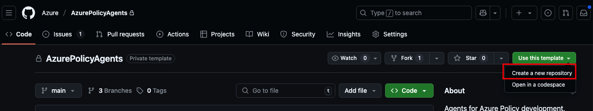
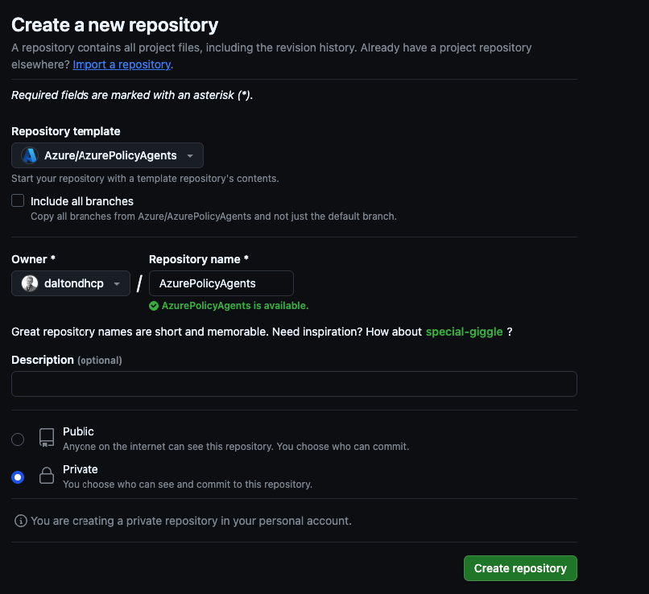
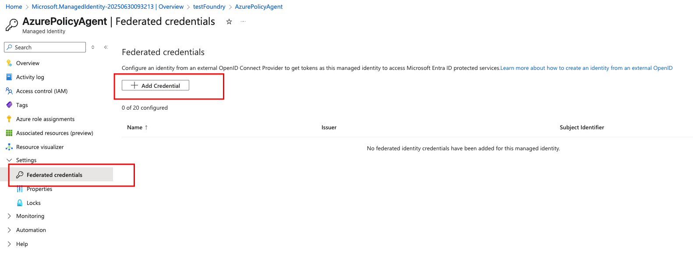
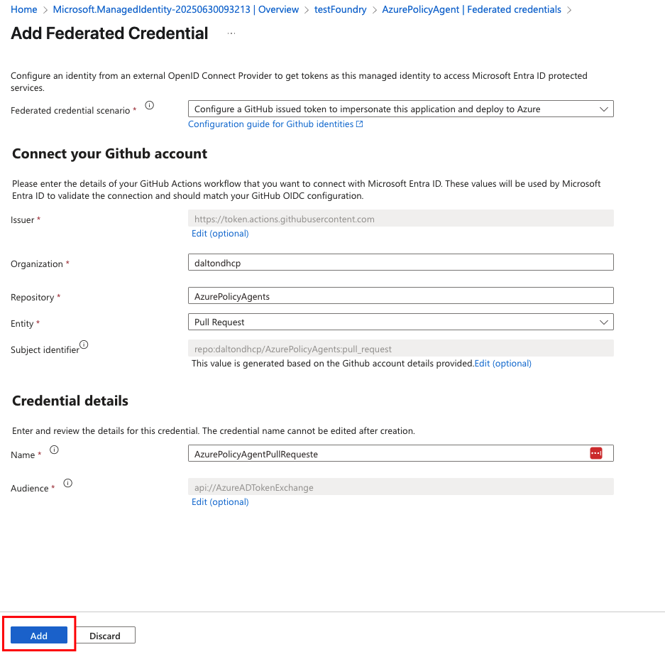
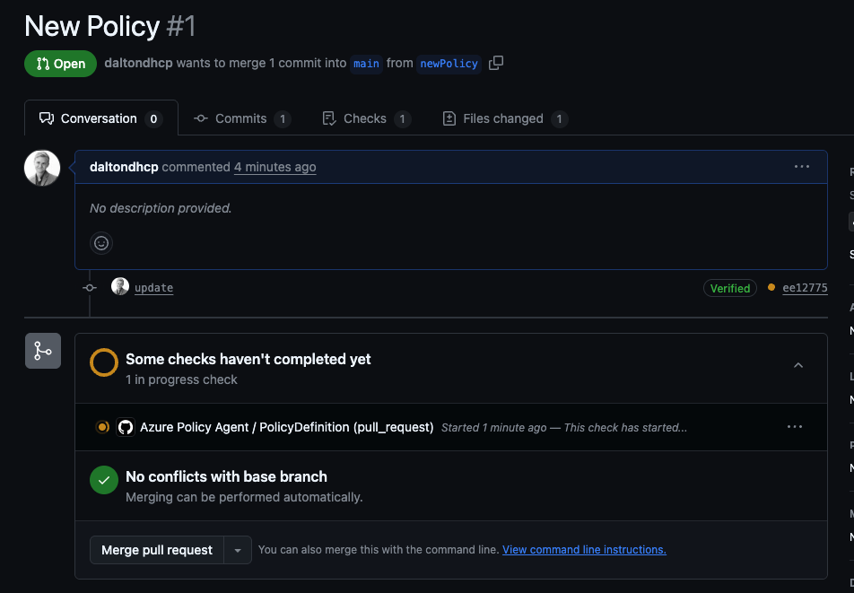
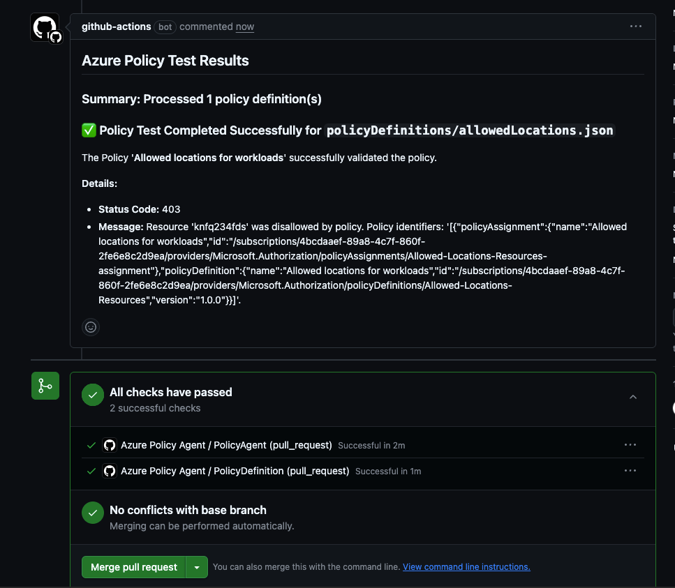

# Azure Policy Agent - Getting Started Guide

## Overview

The Azure Policy Agent is a GitHub Action workflow that automates the deployment and testing of Azure Policy definitions. It deploys policy definitions to Azure and uses Azure AI Foundry agents to generate and execute test scenarios to validate policy behavior.

## Prerequisites

Before you begin, you'll need:

- An Azure subscription with Owner permissions
- Azure CLI or PowerShell installed
- A GitHub repository set up as a template or fork of this repository

## Setup Instructions

### 1. Create Repository from Template

First, create a new repository from this template:




### 2. Deploy Azure AI Infrastructure

Deploy the required Azure AI infrastructure using the Bicep templates. This single deployment will create all necessary resources including Azure AI Foundry project, AI agents, and user-assigned managed identity.

```bash
# Login to Azure
az login

# Set your subscription
az account set --subscription "your-subscription-id"

# Deploy the AI Foundry infrastructure (subscription-level deployment)
az deployment sub create \
  --location "swedencentral" \
  --template-file "infra/bicep/agentsSetup.bicep" \
  --parameters @infra/bicep/agentsSetup.bicepparam 
```

**PowerShell Alternative:**
```powershell
# Login and deploy
Connect-AzAccount
Set-AzContext -SubscriptionId "your-subscription-id"

New-AzSubscriptionDeployment `
  -Location "swedencentral" `
  -TemplateFile "infra/bicep/agentsSetup.bicep" `
  -TemplateParameterFile "infra/bicep/agentsSetup.bicepparam" 
```

Save the outputs from the deployment - you'll need these values for GitHub configuration.

### 3. Configure Federated Identity Credentials

Update the user-assigned managed identity with federated credential details from your repository for pull_request entity:




> **Important**: Replace `YOUR_GITHUB_USERNAME/YOUR_REPO_NAME` with your actual GitHub repository details.

### 4. Configure GitHub Repository Secrets and Variables

Navigate to your GitHub repository → Settings → Secrets and variables → Actions

Add the following **Repository Secrets** (from deployment outputs):

| Secret Name | Description |
|-------------|-------------|
| `AZURE_CLIENT_ID` | User-Assigned Managed Identity Client ID |
| `AZURE_TENANT_ID` | Azure AD Tenant ID |
| `AZURE_SUBSCRIPTION_ID` | Target Azure Subscription ID |

Add the following **Repository Variables** (from deployment outputs):

| Variable Name | Description |
|---------------|-------------|
| `PROJECT_ENDPOINT` | Azure AI Foundry Project Endpoint |
| `ASSISTANT_ID` | Azure AI Agent/Assistant ID |

### 5. Test Your Setup

Create a pull request in the `policyDefinitions` folder to validate that the workflow runs properly:




## Creating Your First Policy Test

1. **Create a policy file**: Add a JSON policy definition to the `policyDefinitions/` folder
2. **Example policy** (`policyDefinitions/test-allowed-locations.json`):

```json
{
  "properties": {
    "displayName": "Test - Allowed locations for resources",
    "policyType": "Custom",
    "mode": "Indexed",
    "description": "Test policy that restricts resource deployment to specific locations",
    "metadata": {
      "category": "General"
    },
    "parameters": {
      "listOfAllowedLocations": {
        "type": "Array",
        "defaultValue": ["eastus", "westus2"],
        "metadata": {
          "displayName": "Allowed locations",
          "description": "List of allowed Azure regions for resource deployment"
        }
      }
    },
    "policyRule": {
      "if": {
        "not": {
          "field": "location",
          "in": "[parameters('listOfAllowedLocations')]"
        }
      },
      "then": {
        "effect": "deny"
      }
    }
  }
}
```

3. **Create a pull request**: Commit your policy file and create a PR
4. **Watch the workflow**: Monitor the GitHub Actions tab for workflow execution
5. **Review results**: Check the PR comments for AI-generated test results

## What to Expect

When you create a pull request with policy changes:

1. **Workflow Triggers**: The GitHub Action automatically starts
2. **Policy Deployment**: Your policies are deployed to the Azure subscription
3. **AI Analysis**: The Azure AI agent analyzes your policy and generates tests
4. **Results Posted**: Detailed test results appear as PR comments

**Example Result**:
```markdown
## Azure Policy Test Results

### Summary: Processed 1 policy definition(s)

### ✅ Policy Test Completed Successfully for `policyDefinitions/test-allowed-locations.json`
The Policy 'Test - Allowed locations for resources' successfully validated.

**Details:**
- Policy correctly blocks resource deployment to unauthorized regions
- Test scenarios confirmed expected deny behavior
- No syntax or logic issues detected
```


## Troubleshooting

### Common Issues

#### Authentication Failures
```
Error: AADSTS700016: Application with identifier 'xxx' was not found
```
**Solution**: Verify your managed identity Client ID is correctly configured in GitHub secrets.

#### Permission Errors
```
Error: Insufficient privileges to complete the operation
```
**Solution**: Ensure your managed identity has Contributor permissions on the target subscription.

#### AI Agent Not Responding
```
Cannot find agent xxx. Please re-create it and retry
```
**Solution**: 
- Verify your `ASSISTANT_ID` variable matches your Azure AI Foundry agent ID
- Check that your AI agent is deployed and active in the Azure AI Foundry portal
- Ensure your `PROJECT_ENDPOINT` is correct and accessible

#### No Policy Files Found
```
No JSON files found in the 'policyDefinitions' directory
```
**Solution**: 
- Ensure your policy files are in the `policyDefinitions/` folder with `.json` extensions
- Check that your PR includes changes to files in the correct directory
- Verify file names don't contain special characters or spaces

#### Bicep Deployment Failures
Check the deployment logs for specific Bicep template errors. Common issues:
- Missing required parameters in `policyDef.parameters.json`
- Invalid policy definition JSON structure
- Resource naming conflicts in Azure
- Insufficient permissions to create policy definitions

#### GitHub Actions Workflow Not Triggering
**Solution**:
- Ensure you're modifying files in `policyDefinitions/*.json`
- Check that the workflow file exists at `.github/workflows/PolicyAgent.yml`
- Verify you have the correct repository permissions
- Make sure the workflow is enabled in your repository settings

### Debug Steps

1. **Check GitHub Actions Logs**: 
   - Go to your repository → Actions tab
   - Click on the failed workflow run
   - Review detailed logs for each job step

2. **Verify Azure Permissions**: 
   ```bash
   # Test your managed identity permissions
   az login --identity --username <client-id>
   az policy definition list --subscription <subscription-id>
   ```

3. **Validate AI Configuration**: 
   - Test your AI agent in the Azure AI Foundry portal
   - Verify the agent responds to basic queries
   - Check that the project endpoint is accessible

4. **Check File Structure**: 
   ```bash
   # Verify your repository structure
   ls -la policyDefinitions/
   cat policyDefinitions/your-policy.json | jq .
   ```

5. **Test Policy JSON**: 
   - Use Azure Policy extension in VS Code for validation
   - Test policy JSON in Azure portal policy definition creator
   - Validate JSON syntax using online JSON validators


## Quick Reference

### File Locations
- Policy definitions: `policyDefinitions/*.json`
- Workflow: `.github/workflows/PolicyAgent.yml`
- Deployment scripts: `.github/scripts/`
- Utilities: `utilities/policyAgent/`
- Infrastructure: `infra/bicep/`

### Required Secrets & Variables
- **Secrets**: `AZURE_CLIENT_ID`, `AZURE_TENANT_ID`, `AZURE_SUBSCRIPTION_ID`
- **Variables**: `PROJECT_ENDPOINT`, `ASSISTANT_ID`

### Workflow Triggers
- Pull requests with changes to `policyDefinitions/*.json`
- Push to main branch

For complete details on how the system works, see the main [README](../README.md).

