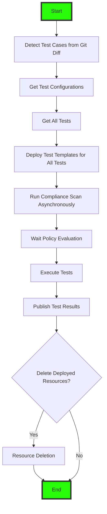

# Policy Integration Tests

## Introduction

Policy Integration tests are implemented to test assigned policies that have the following effects:

- Deny
- Audit & AuditIfNotExists
- Modify & Append
- DeployIfNotExists

>**NOTE**: Only Azure resources that are deployed to `subscription` or `resourceGroup` levels can be governed by Azure Policy. `Tenant` and `ManagementGroup` level resources cannot be governed by Azure Policy. Therefore, the Policy integration tests cannot cover these types of resources.

## Potential Pipeline Workflow

The policy integration tests can be embedded into CI/CD pipelines. The pipelines can be configured to run automatically when a new pull request is created on the repository that contains the Azure Policy Infrastructure as Code solutions. Below is a potential workflow of the pipeline:



## `AzResourceTest` Module

The `AzResourceTest` PowerShell module is a PowerShell module that can be used to perform Azure resource configuration tests using Pester and various native capabilities offered from Azure such as `Azure Resource Graph (ARG)`, `Azure Policy Insights` and `Azure Resource Manager (ARM) What-If APIs`.

It covers the following testing scenarios:

- Azure Resource configurations via Azure Resource Graph (ARG)
- Azure Resource existence via Azure Resource Graph (ARG) or relevant Azure Resource Provider (RP)
- Resource policy compliance via Azure Resource Graph (ARG)
- `Deny` Policy violation via ARM What-If API
- Terraform plan validation (AzAPI provider only) via Azure Policy Restriction API.

### AzResourceTest Commands

The following commands are provided in the `AzResourceTest` module:

| Command Name | Description | Use Cases |
| :----------- | :---------- | :-------- |
| `Test-ARTResourceConfiguration` | Invoke Azure resource tests by passing defined test cases. | Use this command to execute the tests that are defined by the test configuration objects. |
| `New-ARTPropertyValueTestConfig` | Create a new instance of the PropertyValueTestConfig object. This object is used to define a test that checks the value of a property of an existing resource. | `Append` and `Modify` policy effects that require checking the value of a specific property. |
| `New-ARTPropertyCountTestConfig` | Create a new instance of the PropertyCountTestConfig object. This object is used to define a test that checks the count of a property value of an existing resource. | `Append` and `Modify` policy effects that require checking the count of items within an array or the existence of a property. |
| `New-ARTPolicyStateTestConfig` | Create a new instance of the PolicyStateTestConfig object. This object is used to define a test that checks the compliance state of a policy for an existing resource. | `Audit` and `AuditIfNotExists` effects tested by querying Policy Compliance State of an existing resource via Azure Resource Graph. |
| `New-ARTWhatIfDeploymentTestConfig` | Create a new instance of the WhatIfDeploymentTestConfig object. This object is used to define a test that checks the What-If template validation for a given Bicep or ARM template. | `Deny` effects tested via ARM What-If API by passing a Bicep or ARM template with policy-violating configurations to the ARM What-If API. |
| `New-ARTResourceExistenceTestConfig` | Create a new instance of the ResourceExistenceTestConfig object. This object is used to define a test that checks the existence of a resource. | `DeployIfNotExists` effects are tested by querying the existence of the resource via Azure Resource Graph or Azure Resource Provider API. |
| `New-ARTManualWhatIfTestConfig` | Create a new instance of the ManualWhatIfTestConfig object. This object is used to define a test that checks the What-If validation result that is obtained from an external Azure Resource Manager REST API response. | `Deny` effects tested via ARM What-If API by passing the What-If API response that is obtained externally. This is useful when testing resource updates that are not allowed using Bicep or ARM templates (i.e. Subscription tags update). |
| `New-ARTTerraformPolicyRestrictionTestConfig` | Create a new instance of the TerraformPolicyRestrictionTestConfig object. This object is used to define a test that checks the resource configuration from Terraform plan result against the Azure Policy Restriction REST API for a given resource. | `Audit` and `Deny` effects using the Terraform plan result (AzAPI provider only) tested via Azure Policy Restriction API. |
| `New-ARTArmPolicyRestrictionTestConfig` | Create a new instance of the ArmPolicyRestrictionTestConfig object. This object is used to define a test that checks the ARM resource configuration against the Azure Policy Restriction REST API for a given resource. | `Audit` and `Deny` effects using the ARM resource configuration tested via Azure Policy Restriction API. |
| `Get-ARTResourceConfiguration` | Get the configuration of an existing Azure resource via Azure Resource Graph search. | This is a helper function that can be used to examine the configuration of an existing resource when developing test cases. |

## Testing Different Policy Effects

The `AzResourceTest` module provides a function called `Test-ARTResourceConfiguration` that can be used to execute one or more test cases defined for different policy effects. Each test case is defined as a configuration object that specifies the details of the test, such as the resource to be tested, the expected policy violation, and the method of testing.

To prepare for the test cases, firstly create an array for the various test cases:

```PowerShell
#Add test configurations to $tests array
$tests = @()
```

### `Deny` Effect Using Azure Bicep Templates

`Deny` effects are tested via ARM What-If API.

A Bicep template with the target deployment scope of either `subscription` or `resourceGroup` must be created and it should contain configurations that violate the testing policies.

>**NOTE**: When testing the `Deny` policy violation for resources within a resource group, **DO NOT** create a Bicep template with the `subscription` deployment scope that also deploys the resource group. ARM What-If API will not correctly identify the policy violation for a resource inside a resource group if the resource group does not exist. Instead, create a `resource group` scoped test template. The pipeline will automatically create the resource group in a pre-configured region with pre-configured tags if it does not exist.

To configure the test:

```PowerShell
$violatingPolicies = @(
  @{
    policyAssignmentId          = $policyAssignmentId
    policyDefinitionReferenceId = 'abc_111'
  }
  @{
    policyAssignmentId          = $policyAssignmentId
    policyDefinitionReferenceId = 'abc_222'
  }
  @{
    policyAssignmentId          = $policyAssignmentId
    policyDefinitionReferenceId = 'abc_333'
  }
)
$params = @{
  testName = 'Policy violating deployment should fail'
  templateFilePath = $whatIfFailedTemplatePath
  deploymentTargetResourceId = $whatIfDeploymentTargetResourceId
  requiredWhatIfStatus = 'Failed'
  policyViolation = $violatingPolicies
  #Add Parameter file path if a parameter file is required
  parameterFilePath = $parameterFilePath
  #Specify the Bicep module subscription Id if private TS or BR Bicep modules are used
  bicepModuleSubscriptionId = $bicepModuleSubscriptionId
}
$tests += New-ARTWhatIfDeploymentTestConfig @params
```

### `Audit` and `AuditIfNotExists` Effects from existing resources

`Audit` and `AuditIfNotExists` effects are tested by querying Policy Compliance State via Azure Resource Graph.

To configure the test:

```PowerShell
$params = @{
  testName = 'Audit CMK Encryption policy should be NonCompliant'
  resourceId = $resourceId
  policyAssignmentId = $policyAssignmentId
  requiredComplianceState = 'NonCompliant'
  policyDefinitionReferenceId = 'abc_444'
}
$tests += New-ARTPolicyStateTestConfig @params
```

### `Append` and `Modify` Effects

`Append` and `Modify` effects can be tested by checking the actual configuration of the resource. We can use Azure Resource Graph to check the value of a specific property of the resource, or compare the count of items within an array.

To configure the test:

```PowerShell
#Test a single value
$params = @{
  testName = 'Minimum TLS version should be TLS1.2'
  resourceId = $resourceId
  valueType = 'string'
  property = 'properties.minimumTlsVersion'
  condition = 'equals'
  value = 'TLS1_2'
}
$tests += New-ARTPropertyValueTestConfig @params

#Test property count
$params = @{
  testName = 'Should have environment tag'
  resourceId = $resourceId
  property = 'tags.environment'
  condition = 'equals'
  count = 1
}
$tests += New-ARTPropertyCountTestConfig @params

#Test array count
$params = @{
  testName = 'Should Use Private Endpoints'
  resourceId = $resourceId
  property = @('properties.privateEndpointConnections', 'properties.manualPrivateEndpointConnections')
  condition = 'greaterequal'
  count = 1
  operator = 'concat' # indicate the combined count of all specified properties
}
$tests += New-ARTPropertyCountTestConfig @params
```

### `DeployIfNotExists` Effect

`DeployIfNotExists` effects are tested by querying the existence of the resource via Azure Resource Graph or Azure Resource Provider API.

>**NOTE**: Since not all resource types are supported by Azure Resource Graph, some resources may require querying the Azure Resource Provider API. Hence the `AzResourceTest` module also supports querying the Azure Resource Provider API as the backup method.

To configure the test:

```PowerShell
# Test resource existence via Azure Resource Provider API by providing the API version
$diagnosticSettingsAPIVersion = '2021-05-01-preview'
$params = @{
  testName = 'Diagnostic Settings Must Be Configured'
  resourceId = $diagnosticSettingsId
  condition = 'exists'
  apiVersion = $diagnosticSettingsAPIVersion
}

$tests += New-ARTResourceExistenceTestConfig @params

# Test resource existence via Azure Resource Graph
$params = @{
  testName = 'Private DNS Record for Blob PE must exist'
  resourceId = $blobPrivateDNSARecordId
  condition = 'exists'
}
$tests += New-ARTResourceExistenceTestConfig @params

```

### `Audit` and `Deny` Effects for Terraform Plan Validation via Azure Policy Restriction API

`Audit` and `Deny` effects for Terraform plan validation (AzAPI provider only) are tested via Azure Policy Restriction API. The test will submit the Terraform plan to the Restriction API and check the response for any policy violations.

To configure the test:

```PowerShell
#Must run az cli command to get the access token because Terraform only supports az cli authentication.
$token = $(az account get-access-token --resource 'https://management.azure.com/' | convertfrom-json).accessToken
#Specify the Terraform project directory
$terraformDirectory = 'C:\Terraform\MyProject'
#Define the expected policy violations
#The Terraform project would deploy a resource with address 'azapi_resource.storage_account' that violates two policies: one with 'Deny' effect and another with 'Audit' effect.
$violatingPolicies = @(
  @{
    policyAssignmentId = '/providers/Microsoft.Management/managementGroups/myMG/providers/Microsoft.Authorization/policyAssignments/myPolicyAssignment'
    policyDefinitionReferenceId = 'STG-001'
    resourceReference = 'azapi_resource.storage_account'
    policyEffect = 'Deny'
  }
  @{
    policyAssignmentId = '/providers/Microsoft.Management/managementGroups/myMG/providers/Microsoft.Authorization/policyAssignments/myPolicyAssignment'
    policyDefinitionReferenceId = 'STG-002'
    resourceReference = 'azapi_resource.storage_account'
    policyEffect = 'Audit'
  }
)
$tests += New-ARTTerraformPolicyRestrictionTestConfig 'Storage Account should violate deny policies' $token $terraformDirectory  $violatingPolicies

#Above command creates a new instance of the TerraformPolicyRestrictionTestConfig object by passing required parameters in the correct order "testName", "token", "terraformDirectory" and "policyViolation".
```

### Test Execution

The tests are executed using the `Test-ARTResourceConfiguration` function. The function takes the test configuration object as input and executes the test.

```PowerShell
$params = @{
  tests         = $tests
  testTitle     = "Storage Account Configuration Test"
  contextTitle  = "Storage Configuration"
  testSuiteName = 'StorageAccountTest'
  OutputFile    = $outputFilePath
  OutputFormat  = 'NUnitXml'

}
Test-ARTResourceConfiguration @params
```

## Example Test Cases

The following example test cases can be found here:

| Test Case Name | Tested Azure Resources | Policy Effects | Comment |
| :------------- | :--------------------- | :------------- | :------ |
| [key-vault](./key-vault) | Azure Key Vault | `Deny`, `Audit`, `Modify`, `DeployIfNotExists` | Reference for testing Key Vault related policies using a set of Bicep templates. |
| [monitor](./monitor) | Azure Monitor resources such as Log Analytics Workspace and Action Group, etc. | `Deny`, `Audit`, `DeployIfNotExists` | Reference for testing Azure Monitor related policies using a set of Bicep templates, as well as using Azure Policy Restriction API. |
| [storage-account-tf](./storage-account-tf) | Azure Storage Account | `Deny`, `Audit`, `Modify`, `DeployIfNotExists`  | Reference for testing Storage Account related policies using Terraform (using the Terraform `AzAPI` provider and Azure Policy Restriction API). |
| [tags](./tags) | Subscription and Resource Group tags | `Deny`, `Modify` | Reference for testing subscription and resource group tagging policies using Bicep templates and manual What-If API response from resource update request (updating tags of an existing subscription). |

## Get Started

To get started with the policy integration tests:

1. Refer to the [Test Template for Azure Policy Integration Tests](./test-template/README.md) which provides a step-by-step guide on how to create your own test case using the provided test template.
2. Refer to the [Policy Integration Tests - Global Configuration](./TEST-GLOBAL-CONFIG.md) document to understand the global configuration settings that are required for the tests and to ensure your test case is properly configured.
3. Refer to the [Policy Integration Tests - Local Configuration](./TEST-LOCAL-CONFIG.md) document to understand the configuration variables that are required for defining your test case.

## Limitations

The `AzResourceTest` module does not support testing policies with [resource provider modes](https://learn.microsoft.com/en-us/azure/governance/policy/concepts/definition-structure-basics#resource-provider-modes).

## References

The `AzResourceTest` module uses the following Azure APIs:

- [Azure Resource Manager Deployment What-If](https://learn.microsoft.com/rest/api/resources/deployments/what-if?view=rest-resources-2025-04-01&tabs=HTTP)
- [Azure Resource Graph](https://learn.microsoft.com/rest/api/azureresourcegraph/resourcegraph/resources/resources?view=rest-azureresourcegraph-resourcegraph-2024-04-01&tabs=HTTP)
- [Azure Resource Manager Resource GET](https://learn.microsoft.com/rest/api/resources/resources/get?view=rest-resources-2021-04-01)
- [Azure Policy Insights Policy State](https://learn.microsoft.com/rest/api/policyinsights/policy-states?view=rest-policyinsights-2024-10-01)
- [Azure Policy Restriction](https://learn.microsoft.com/rest/api/policyinsights/policy-restrictions?view=rest-policyinsights-2024-10-01)
